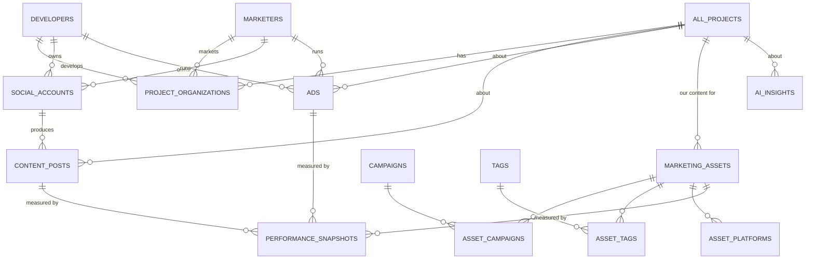

# Project Marketing Intelligence — Design Specification

> **Status:** **Phase 0 foundation BUILT + pilot imported (2026-07-22).** The
> design below stands; this header records what is now live vs. still ahead.
> **Author:** Claude, 2026-07-22. **Reviewer:** r.abanumay@wassel.re.

## ✅ Phase 0 — implemented & verified (2026-07-22)

**Confirmed decisions (all resolved):** storage = existing Supabase Files system
(**Google Drive NOT introduced** — D1 resolved). Collection = **Apify** (primary,
IG/TikTok/FB/Meta ads) + **YouTube Data API v3** (official, public) + **Browserbase**
(fallback only). Org model = `mkt_organizations` linked to existing `developers`
via `developer_record_id` (developers table untouched — D2). High-volume data =
physical `mkt_*` tables (D3). Attribution = auto-candidate + human review (D4).
Meta Ad Library = best-effort, KSA commercial ads not in the official API (D5).

**Shipped:**
- **13 normalized tables** (`mkt_organizations`, `mkt_social_accounts`,
  `mkt_project_organizations`, `mkt_content_posts`, `mkt_content_attributions`,
  `mkt_metric_snapshots`, `mkt_paid_ads`, `mkt_ad_attributions`,
  `mkt_raw_ingestions`, `mkt_ingestion_runs`, `mkt_providers`, `mkt_actor_configs`,
  `mkt_assets`) + RLS + indexes. Migrations:
  `supabase/migrations/2026-07-22_marketing_intelligence_core.sql` + `_rpcs.sql`.
- **7 ingestion RPCs** (idempotent upsert / metric snapshot / attribution upsert /
  run bookkeeping / raw retain / cleanup). Dedup **verified live**: same post ×3 and
  from 2 providers → 1 row, providers accumulated, latest metric wins.
- **Provider layer** (`api/_lib/marketing/`): `MarketingIntelligenceProvider`
  interface, registry, **YouTube adapter (real Data API v3)**, **Apify foundation**
  (DB-driven actor registry, run/poll/dataset + named parsers), **Browserbase
  fallback** wrapper. `normalize.ts` = canonical-url + content-fingerprint dedup.
- **Read/write API** `POST /api/marketing` (overview / content / marketers /
  attribution review + decide / provider health). **Marketing tab** on every
  project record (`MarketingTabPane`): Overview · Developer · Marketers · Paid Ads ·
  Collection Status, with per-item source + freshness + candidate-review actions.
- **Pilot import:** 151 TikTok posts (5 orgs, 5 accounts) → normalized tables with
  48 attributions (45 auto-accepted, 3 candidates), 398 metric snapshots + raw
  payloads. **Fully idempotent** (re-run = 0 new). `project_videos` untouched.
- **14 new tests** (dedup, provider-not-configured, invalid creds, YouTube
  pagination + quota, Browserbase fallback). `601/601` suite green; typecheck clean.

**Env vars added** (`.env.example`, all server-side): `APIFY_API_TOKEN`,
`YOUTUBE_DATA_API_KEY` (+ existing `BROWSERBASE_API_KEY`/`_PROJECT_ID`). All start
`not_configured`; integrations go live when the secrets are set.

**Selected Apify actors** (seeded DISABLED in `mkt_actor_configs`, pending vetting +
token): `apify/instagram-scraper` (IG profile/posts/reels), `clockworks/tiktok-scraper`
(TikTok), `apify/facebook-posts-scraper` (FB), `apify/facebook-ads-scraper` (Meta Ad
Library). Chosen for: active maintenance, public-only data, rich output fields,
per-run pricing. Final selection confirm on live output before enabling.

**Not yet built (next):** worker queue wiring (`mkt_*_jobs` + scheduling — collection
still runs via the pilot import script, not the worker), Apify/YouTube live runs
(need tokens), Paid-ads ingestion, Our-Content upload UI, AI insights, embeddings.

---

## 0. Framing decisions (read first)

Six decisions shape everything below. Each has a recommendation; flagged ones need your sign-off because they contradict the brief or carry migration cost.

| # | Decision | Recommendation | Why it matters |
|---|---|---|---|
| D1 | **Storage: Google Drive vs. existing Supabase Files** | **Use the existing Supabase Files system** (the app already brands it "Drive"). Add an optional Google-Drive *import* connector later. | ⚠️ Contradicts the brief. There is **no Google Drive API integration in the codebase** — "Drive" in the UI = `files` table + `wassel-files`/`marketing-assets` buckets. It already delivers exactly the "metadata in DB, files in storage, folders not the source of truth" philosophy you asked for, plus previews, PDF compression, RLS, record-linking, and signed URLs. Real Google Drive adds OAuth, per-user quotas, latency, and a *second* permission surface that RLS can't see. |
| D2 | **Org model: unified `organizations` vs. keep `developers` + add `marketers`** | **Phase it:** MVP adds a `marketers` model + shared `social_accounts` table and keeps `developers` as-is; V2 unifies both under `organizations(kind)` with a `developers` compatibility view. | `developers` has 200 rows referenced by lookups across `all_projects`/units. A big-bang rename risks the whole project graph. The normalized end-state is still "Organizations + Social Accounts" as you specced — we just get there without breaking live lookups. |
| D3 | **High-volume tables: JSONB `records` vs. physical Postgres tables** | **Physical tables** for `content_posts`, `ads`, `performance_snapshots` (millions of rows, continuous ingestion). **Model-backed** (`records`/frozen) for the human-curated `marketing_assets` library + `marketers` so the Builder/record UI, RLS, and Realtime work for free. | Matches how you already run `market_listings` (53k) and the freeze infrastructure. Scale lives in physical tables read via dedicated endpoints; human-edited data lives in the model system. |
| D4 | **Marketer→project attribution** | **Hybrid**: a curated marketer registry, scraped, auto-attributing any post that names a project (project appears in caption/hashtags); you confirm/override. Attribution is itself a stored, auditable field. | Fully-manual doesn't scale to "every project"; fully-auto mis-files. The YouTube/IG passes already proved caption-matching works with a human curation pass. |
| D5 | **Meta Ad Library for KSA commercial ads** | **Treat as best-effort, not guaranteed.** Build the `ads` table + ingestion abstraction now; wire the official API where it returns data; fall back to Browserbase page-capture + manual entry for KSA commercial ads. | ⚠️ Biggest external risk. Meta's **Ad Library API only returns *all* ad types inside the EU**; outside the EU (incl. Saudi Arabia) the API returns **only political/issue/electoral ads**. Real-estate ads in KSA will *not* come back from the official API. See §7. |
| D6 | **Rollout** | **Pilot 2–3 projects end-to-end**, validate schema + attribution + dashboards, then backfill all 49 and turn on continuous collection. | A schema mistake replicated across 49 projects × thousands of assets is expensive to unwind. |

Everything downstream assumes D1–D6 as recommended unless you change them.

---

## 1. Feature specification

A new **Marketing** tab on every project (`all_projects`) record, rendered via the existing `RecordTabBar` pattern (same mechanism as the "Client Details" 360° tab). Six sub-views:

### 1.1 Overview (dashboard)
Read-only roll-up. Cards + a timeline + an AI summary block.

- **Our Library:** total assets · ready-to-publish · drafts · published-this-month.
- **Developer:** total posts · posts-this-month · videos · images · active Meta ads.
- **Competitors:** # marketers · total project posts · active Meta ads.
- **Recent activity** feed (union of newest posts/ads/asset changes across all sources).
- **Marketing timeline** (posts + ads + our publishes on one time axis).
- **AI summary** — 3–6 natural-language findings generated from snapshot deltas (e.g. "Developer posting +40% MoM", "3 competitors launched campaigns", "no construction-progress content this month", "financing hooks dominate").

### 1.2 Our Content Library
The internal content database. Every asset = one record with rich metadata (fields in §2.4). Drag-and-drop upload, bulk actions, powerful filter/search. Example queries the search must serve: *"all drone videos"*, *"approved Instagram reels"*, *"videos mentioning financing"*, *"Arabic content"*. An asset belongs to **one project**, **≥0 campaigns**, **≥1 platforms**, **≥0 tags** — no folders, no duplication.

### 1.3 Developer
The project's single developer. Profile (name, website, IG/TikTok/Snap/X/YouTube/Facebook). Auto-collected **organic** feed (posts/reels/videos/photos, dates, captions, engagement) + a dashboard (posts this week/month, posting frequency, avg engagement, most-viewed, most-recent). **Paid**: Meta Ad Library creatives/copy/CTA/landing/start-date where available (no spend estimates — Meta doesn't expose it).

### 1.4 Competitor Marketers
The highest-value view. Many marketers per project. Per marketer: company, website, socials, followers. Collected organic (total project posts, videos, photos, reels, frequency, avg views/engagement, top content) + paid (Meta ads). A **sortable/filterable table**: Marketer · Posts · Videos · Images · Avg Views · Avg Engagement · Active Ads · Posting Frequency · Recent Activity.

### 1.5 Paid Ads
All ads grouped by **Developer / Competitors / Us**. Per ad: platform, creative, headline, description, CTA, landing page, start date, active status. Meta is the MVP source; the schema is platform-agnostic so TikTok/Snapchat ad sources drop in later.

### 1.6 Insights
Auto-generated intelligence that **compares historical snapshots, not just current state**: posting-frequency deltas, who's dominating a platform, content-type gaps ("no construction updates"), what hooks/formats win ("drone → highest engagement", "installments = most common hook", "luxury lifestyle underrepresented").

---

## 2. Database schema

Naming follows repo conventions (snake_case, `_ar`/`_en` labels for model-backed entities, `try_numeric`-style tolerance). **M** = model-backed (JSONB `records`, shows in Builder/record UI). **P** = physical table (ingestion scale, dedicated endpoints).

### 2.1 Organizations & social (D2)
```
marketers (M)                      -- MVP; folds into organizations(kind) in V2
  id, name_ar, name_en, website, org_kind ('marketer'|'agency'|'influencer'),
  followers_cached int, hq_city, notes, is_active bool

social_accounts (P)                -- one row per (org, platform)
  id uuid pk
  owner_kind text  ('developer'|'marketer'|'owned')   -- 'owned' = Wassel's own accounts
  owner_id  uuid   (-> developers.id | marketers.id | null)
  platform  text   ('instagram'|'tiktok'|'snapchat'|'youtube'|'x'|'facebook')
  handle    text, url text, followers int, verified bool,
  auth_ref  text,                 -- which cookie/credential set to scrape with
  last_scraped_at timestamptz, scrape_status text
  unique (platform, handle)

project_organizations (P)          -- projects <-> orgs (developer is 1:1, marketers M:N)
  id, project_id uuid (-> all_projects), owner_kind, owner_id,
  role text ('developer'|'marketer'),
  attribution_source text ('manual'|'auto_caption'|'auto_hashtag'|'confirmed'),
  confidence numeric, first_seen_at, last_seen_at
  unique (project_id, owner_kind, owner_id, role)
```
`developers` gains no schema break; social handles live in `social_accounts` for both org kinds uniformly.

### 2.2 Our content library (M) — `marketing_assets`
Model-backed so it inherits Builder, RLS scope, Realtime, record UI. Fields in §2.4. Junctions:
```
marketing_assets (M)               -- one row per OUR creative
tags (M)                           -- controlled vocabulary, bilingual
asset_tags (P)        (asset_id, tag_id)                    -- M:N
asset_platforms (P)   (asset_id, platform)                  -- M:N (target platforms)
campaigns (M)         id, project_id, name, objective, start, end, status
  -- asset.campaign is M:N -> asset_campaigns (P) (asset_id, campaign_id)
```

### 2.3 External content & ads (P) — the scraped world
```
content_posts (P)                  -- developer & marketer ORGANIC posts
  id, project_id (nullable until attributed), owner_kind, owner_id, social_account_id,
  platform, external_id, post_url, media_type ('image'|'video'|'carousel'|'reel'|'story'),
  caption, lang, posted_at, thumbnail_ref, media_ref (bucket path or external url),
  hashtags text[], mentions text[],
  engagement jsonb (views,likes,comments,shares,saves),   -- latest snapshot cache
  first_collected_at, last_collected_at, content_hash     -- dedup
  unique (platform, external_id)

ads (P)                            -- PAID (Meta Ad Library MVP; platform-agnostic)
  id, project_id (nullable), owner_kind, owner_id, platform ('meta'|'tiktok'|'snapchat'),
  ad_archive_id, page_name, creative_media_ref, creative_type, headline, body, cta,
  landing_url, started_at, ended_at, is_active bool, raw jsonb,
  first_collected_at, last_collected_at
  unique (platform, ad_archive_id)

performance_snapshots (P)          -- TIME SERIES → powers trend AI (§6/§1.6)
  id, subject_type ('post'|'ad'|'account'|'asset'), subject_id uuid,
  captured_at timestamptz, metrics jsonb, source text
  index (subject_type, subject_id, captured_at desc)

ai_insights (P)
  id, project_id, kind, severity ('info'|'opportunity'|'warning'), title, body,
  evidence jsonb (ids + numbers behind the claim), window_start, window_end,
  generated_at, model, dismissed bool
```

### 2.4 `marketing_assets` fields (the Our-Content record)
Basic: project (lookup) · campaigns (M:N) · title · description · status · version · creator (user) · upload_date.
Media: file (Files/Drive ref) · thumbnail · preview · duration · resolution.
Content type: reel · story · carousel · image · video · drone · animation · floor_plan · testimonial · lifestyle · construction_update.
Purpose: awareness · lead_gen · retargeting · branding · education.
Platform (M:N): instagram · tiktok · snapchat · x · youtube · facebook.
Language · tags (M:N) · hook · cta · caption · script.
Production stage: raw · editing · review · approved · published · archived.
Performance: views · reach · likes · saves · shares · comments · leads · cost · cpl · roas *(populated from `performance_snapshots`, not hand-entered)*.

> **AI-future hooks (schema is ready for them):** add later without migration pain — `marketing_assets.transcript`, `.ocr_text`, `.detected_logos jsonb`, `.scene_tags jsonb`, and an `asset_embeddings (asset_id, embedding vector)` table (pgvector) enabling "find similar" / semantic search. Everything in "Future AI Features" (transcription, caption/hashtag/hook gen, scene detection, OCR, logo/building recognition, dedup via `content_hash`, similarity, AI tagging/search) attaches to these columns.

---

## 3. Entity relationships (ERD)



Cardinalities: project→developer is **1** (via `project_organizations role='developer'`), project→marketers is **many**, org→social_accounts is **many**, social_account→posts is **many**, any subject→snapshots is **many** (time series). No content is duplicated: an asset/post is one row; its platforms/tags/campaigns are junctions.

---

## 4. Backend architecture

Fits the existing stack (Vercel API routes + Supabase RPCs + RLS + Realtime + Fly worker).

- **Reads:** model-backed entities (`marketing_assets`, `marketers`, `campaigns`, `tags`) flow through the existing store + `unified_records`/per-model views + RLS. High-volume physical tables (`content_posts`, `ads`, `snapshots`, `insights`) get **dedicated read endpoints** (`/api/marketing/*`) with server-side pagination/filter/sort (keyset, never `OFFSET` on big tables — see the RLS×OFFSET lesson), returning slim projections. A `project_marketing_overview(project_id)` **SQL function** assembles the Overview cards in one round-trip.
- **Writes (our content):** through the normal `record_save` path (RLS, versioning, activity_log) so the library respects per-profile scope and the audit trail.
- **Writes (ingested data):** **service-role only, from the Fly worker** (same posture as deck/image/migration queues). The SPA never writes `content_posts`/`ads`/`snapshots`.
- **RLS:** model-backed tables use the standard `wassell_*` scope evaluators. Physical ingestion tables are readable by any authenticated user gated on **project visibility** (you can see a project's marketing iff you can see the project) — mirrors the document-templates posture.
- **Realtime:** the worker's inserts to `content_posts`/`ads`/`insights` fan out to the open Marketing tab (same as decks/image-chats), so dashboards update live during a collection run.
- **Config surface:** a `/settings/marketing-sources` admin page to manage the marketer registry, social handles, credential/cookie sets, and collection schedules.

---

## 5. Data ingestion strategy

A **seventh… tenth queue family** on the existing Fly worker (you already run 6: decks, image, office-preview, pdf-compress, document, data-migration). Same claim/complete/fail/watchdog RPC shape, same `keepAlive` Browserbase sessions, same SA residential proxy + cookie auth proven in this session.

```
social_scrape_jobs (P)   kind=('profile'|'backfill')
   input: social_account_id
   worker: Browserbase(SA proxy + cookies) → capture the platform's post-list XHR →
           upsert content_posts (dedup on (platform,external_id)+content_hash) →
           write a performance_snapshot per post/account →
           re-host thumbnails/videos to marketing-assets bucket (public, cheap render) →
           run attribution (§ D4) → upsert project_organizations
ad_library_jobs (P)      input: org or page_id → Meta Ad Library (API where allowed,
           else Browserbase page-capture) → upsert ads + snapshots
insight_jobs (P)         input: project_id → read latest vs prior snapshots + posts →
           Claude summarizes deltas → upsert ai_insights
```
- **Scheduling:** cron-style (the app already schedules the `market_listings` daily new-scan + Friday full reconcile, and Scheduled Reports). Developer/marketer profiles refresh **daily**; a **weekly** deep backfill; ad library **daily**; insights **weekly** (or on-demand from the Overview).
- **Snapshots are append-only** — every run stamps a new `performance_snapshots` row so trends are real history, not overwrites. This is the backbone of §1.6/§6.
- **Idempotency & dedup:** `unique(platform, external_id)` + `content_hash` (perceptual hash later for near-dupes). Re-running a scrape updates the engagement cache + adds a snapshot; it never duplicates a post.
- **Media handling:** store the **reference** for external posts (thumbnail + video re-hosted to `marketing-assets` for reliable render, as the video pass already does); keep OUR uploads in the Files system. Never re-upload competitor media as if it were ours (see §11 legal).

---

## 6. Social platform integration strategy

| Platform | Best available method | Auth | Reliability | Notes |
|---|---|---|---|---|
| **YouTube** | **Official Data API v3** | API key | ★★★★★ | The clean one. Channels, uploads, view/like counts, publish dates — all first-party. Use for both developer & marketer YT. Quota-limited (10k units/day) — batch. |
| **Instagram** | Browserbase + logged-in cookies, capture reels/posts XHR | Cookie set (`wasselautoacc`) | ★★★☆☆ | No official API for arbitrary public accounts (Graph API only covers accounts you manage). Proven this session. Likes increasingly hidden; captions/media/dates reliable. Rate-limited → SA proxy + pacing. |
| **TikTok** | Browserbase + cookies, capture `/api/post/item_list` | Cookie set (`wasselre`) | ★★★☆☆ | No open data API (Research API is gated/academic). Proven this session (48+48+35 pull). Single-IP profile fetch 403s fast → **must** run through Browserbase rotating residential IPs, not a home IP. |
| **Snapchat** | Public profile / Spotlight page capture | limited | ★★☆☆☆ | Thinnest public surface; often no per-post metrics. Treat as best-effort; many marketers barely use it for durable content. |
| **X (Twitter)** | Official API | paid tier | ★★☆☆☆ | API now expensive/gated; scraping hostile. Low priority for real-estate marketing. |
| **Facebook** | Meta Graph (owned pages) / Ad Library (ads) | app token | ★★☆☆☆ | Organic reach for non-owned pages ≈ unavailable via API; covered mainly through the Ad Library for paid. |

**Design principle:** one `Platform Adapter` interface (`listPosts(account) → RawPost[]`, `getAccountStats(account)`), one adapter per platform, all feeding the same `content_posts`/`snapshots` upsert. Adding Snapchat/X later = a new adapter, no schema change. Cookie/credential sets are stored per `social_accounts.auth_ref` and rotated; expired-cookie detection surfaces as a `scrape_status` on the account (loud, not silent).

---

## 7. Meta Ad Library integration (paid)

**The honest constraint (D5).** Meta's Ad Library has two faces:
- **Official Graph API (`ads_archive`)** — returns **all ad categories only for ads targeted in the EU**. Outside the EU (Saudi Arabia included) it returns **only political/issue/electoral ads**. Real-estate/commercial ads in KSA are **not** retrievable via the official API. Requires a Meta app + verified access token.
- **Ad Library website** (`facebook.com/ads/library`) — *does* show KSA commercial ads to a human, but it's JS-heavy, rate-limited, and programmatic access is against Meta ToS and breaks often.

**Recommended approach:**
1. Build the `ads` table + an `AdSource` abstraction now.
2. Wire the **official API** for any categories/regions where it returns data (future-proofs, zero-ToS-risk).
3. For KSA commercial ads (the ones you actually care about): **Browserbase page-capture** of the Ad Library results for a given page/keyword, best-effort, clearly labeled as scraped + a **manual-entry** path in the Paid Ads UI so the team can log an ad the scraper missed. Capture creative, copy, CTA, landing, start-date, active-flag — **never** spend (Meta doesn't expose it).
4. Architect TikTok Ad Library / Snapchat Ad Library as additional `AdSource`s for later (both have public ad libraries with similar constraints).

Set expectations in the UI: "Ad coverage is best-effort; Meta does not provide a complete commercial-ad API for this region."

---

## 8. Storage architecture (D1)

**Recommendation: the existing Supabase Files system is the store of record; Google Drive is optional import only.**

- **OUR content** (`marketing_assets`) → `files` rows + `wassel-files` (private, signed URLs, RLS) exactly like every other uploaded asset today; the record stores the `files.id`. You inherit previews, PDF/office rendering, compression, folder-linking, and share-links for free.
- **Ingested external media** (thumbnails, re-hosted competitor/developer videos) → `marketing-assets` bucket (public, cheap render) as the video pass already does. These are *references to public content*, not private files.
- **The asset record stores:** storage ref (bucket+path or `files.id`) · preview URL · thumbnail · full metadata · project · campaign(s) · status · creator · platform(s) · tags. **Folders are never the source of truth** — the DB is. This is already true in the Files system.
- **If you specifically want Google Drive** (e.g. the design team lives in Drive): add a **one-way import connector** (Drive OAuth → pull file + metadata → create a `marketing_assets` record referencing a re-hosted copy). That's a V2/V3 add-on, not the foundation. Building *on* Drive as the primary store means every permission check, preview, and search has to round-trip Google — a large downgrade from what you have.

---

## 9. UI wireframes (low-fidelity)

Existing design system: Copper Bronze `#B8734F`, Charcoal sidebar, Amiri, RTL-first, `.card` (add `p-5`), cards+tables. New **Marketing** tab sits in the record `RecordTabBar` next to Overview/Media/Units.

**Overview**
```
┌ Marketing ▸ Overview ───────────────────────────────────────────────┐
│ [Our Library]   [Developer]   [Competitors]   [Paid Ads]            │
│  128 assets      342 posts      6 marketers     14 active           │
│  12 ready        +38 this mo    488 posts       Meta                 │
│  ...             9 active ads   9 active ads                         │
│ ┌ AI Summary ───────────────────────────────────────────────────┐  │
│ │ • Developer posting +40% MoM  • 3 marketers launched campaigns │  │
│ │ • No construction-progress content in 30d  • Financing hooks…  │  │
│ └───────────────────────────────────────────────────────────────┘  │
│ ┌ Marketing timeline ──────────────────────────────────────────┐   │
│ │  ▁▂▅▇▃▂  posts   ● our publish   ▲ ad launch                  │   │
│ └──────────────────────────────────────────────────────────────┘   │
│ Recent activity ▸ list                                              │
└──────────────────────────────────────────────────────────────────────┘
```

**Our Content Library**
```
┌ Marketing ▸ Our Content ────────────────────────────────────────────┐
│ [🔎 search captions/tags/type…]  [Type▾][Stage▾][Platform▾][Lang▾]  │
│ [+ Upload / drag-drop]                         [Bulk: tag|stage|del] │
│ ┌ card ┐ ┌ card ┐ ┌ card ┐ ┌ card ┐   ← media-first grid            │
│ │▶ reel│ │ img  │ │drone │ │ reel │      thumbnail, title, stage pill│
│ └──────┘ └──────┘ └──────┘ └──────┘                                  │
│  ⇅ toggle to table view (sortable columns incl. performance)        │
└──────────────────────────────────────────────────────────────────────┘
```

**Competitor Marketers** (the money view)
```
┌ Marketing ▸ Competitors ────────────────────────────────────────────┐
│ Marketer      Posts Vid Img AvgViews AvgEng Ads Freq   Recent        │
│ منصة شأن        42   30  12   18.2k   3.1%   4  1.4/wk  2d ago  ▸    │
│ نبيل معافا      31   28   3   26.7k   4.0%   0  0.9/wk  5d ago  ▸    │
│ MAALYAMII       19   11   8    9.1k   2.2%   2  0.6/wk  1d ago  ▸    │
│  … sortable / filterable ; row ▸ opens that marketer's project feed  │
└──────────────────────────────────────────────────────────────────────┘
```
Developer, Paid Ads, and Insights follow the same card+table language (creatives grid for ads; insight cards with severity color + "evidence" expander for Insights).

---

## 10. Phased implementation plan

**Phase 0 — Foundations (pilot on 2–3 projects)**
Schema (§2) for `marketers`, `social_accounts`, `project_organizations`, `marketing_assets` + junctions, `content_posts`, `performance_snapshots`. Marketing tab shell + Overview + Our Content Library (upload/metadata/search/filter/bulk) on the Files system. Developer social handles entered. Manual marketer assignment.

**Phase 1 — MVP (organic collection)**
`social_scrape_jobs` worker queue + YouTube API + IG/TikTok Browserbase adapters. Developer + marketer organic feeds → `content_posts` + daily snapshots + hybrid attribution. Overview cards live. Competitor table (sortable). Rule-based insights + a single AI summary. **Backfill all 49 projects; turn on daily collection.**

**Phase 2 — Paid + trends + richer insights**
`ad_library_jobs` (official API + best-effort KSA capture + manual entry). Paid Ads view (Developer/Competitors/Us). `insight_jobs` comparing snapshot windows → real trend intelligence (§1.6). Campaigns. Performance snapshots surfaced as sparklines. Followers/engagement history.

**Phase 3 — AI content intelligence + attribution to sales**
pgvector embeddings + "find similar / find our best financing reels"; transcription, OCR, scene/logo/building detection, perceptual dedup, AI auto-tagging. TikTok/Snapchat ad sources. Tie `leads/cost/roas` to the CRM's existing sales + WhatsApp/lead data for real ROAS. Optional Google-Drive import connector.

---

## 11. Risks, limitations & constraints

- **Meta Ad Library / KSA (highest):** official API won't return KSA commercial ads (§7). Paid-ad coverage is best-effort; set that expectation in-product.
- **Scraping fragility & ToS:** IG/TikTok/Snap have no sanctioned API for third-party public accounts. Adapters break on layout/endpoint changes; treat each as maintenance surface. Rate limits require Browserbase residential rotation + pacing; single-IP fetch 403s (proven). Cookies expire → detect and surface loudly (`scrape_status`), never fail silently.
- **Hidden engagement:** IG hides like counts in many contexts; TikTok view counts are present but likes/shares vary. Store what's available; don't fabricate.
- **Legal / copyright:** competitor/developer creatives are *their* IP. Store **references, thumbnails, and metadata** for intelligence; re-host for reliable rendering **inside the tool only**; never republish scraped competitor media as Wassel content or externally. Keep an eye on platform ToS for automated collection.
- **Attribution error:** generic captions ("سدن في حي الصفا") don't carry a project number — auto-attribution needs the human confirm step (D4). Store attribution provenance + confidence so it's auditable and correctable.
- **Scale/cost:** millions of assets/snapshots → physical tables + keyset pagination + partitioning `performance_snapshots` by month; media in object storage, not Postgres. Browserbase minutes + storage egress are the recurring cost drivers — budget per collection cadence.
- **Data freshness vs. cost:** daily for active projects, weekly for dormant; make cadence per-project configurable.
- **Identity resolution:** the same marketer across platforms/handles, and cross-marketer dedup of the same reel — needs an org-identity + `content_hash` strategy (already in schema).

---

## Appendix — how this reuses what already exists

| Need | Already in the codebase |
|---|---|
| Ingestion workers | Fly worker + 6 queue pattern (`deck_jobs` … `document_jobs`) |
| Scraping w/ auth | Browserbase + SA residential proxy + cookie auth (proven this session); REGA `ContactAdvertiserPanel` precedent |
| High-volume ingestion | `market_listings` (53k) daily scan + Friday reconcile |
| File storage + previews | Files system (`files` table, `wassel-files`/`marketing-assets`, office-preview + pdf-compress queues) |
| Record tabs | `RecordTabBar` (Client Details 360° tab) |
| Media library | `media_assets` (Image Chats v3) — pattern for the asset library |
| Scheduled runs | `market_listings` cron + Scheduled Reports |
| AI over data | `aiAgent`/analytics `runAnalyticsQuery`; Claude for insight summaries |
| Live dashboards | Supabase Realtime fan-out (decks/image-chats) |
| Audit | `activity_log` |
```
